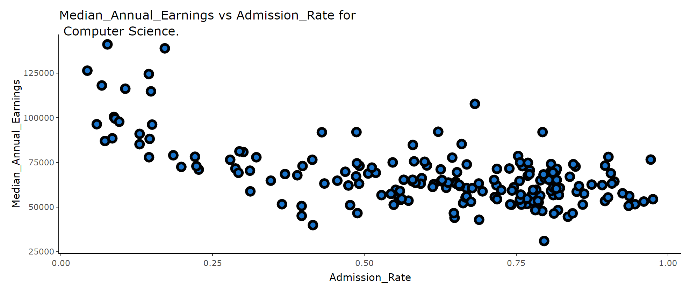

# College Scorecard App

_Author: Andrew Bridglall_

## Description

This application allows users to explore earnings and debt data for different majors at US colleges. Users can then visualize proportions such as college graduation rates per state. The data for this application was sourced from the US Department of Education [College Scorecard](https://collegescorecard.ed.gov/data/). The aim for this application is to better enable students and parents to identify locations, universities and majors of study that match their long-term goals.

_Note: Choropleth runs locally but does not yet run when deployed to the web._
